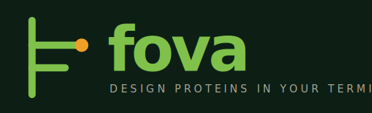

<div align="center">



<br/>

[](#status)
[](https://github.com/alvarogonjim/fova/releases)
[](LICENSE)
[](https://go.dev)
[](#install)

**A terminal agent for de novo protein design.**
It plans, runs, and ranks design jobs — and (optionally) ships the survivors to a wet lab —
from a single Go binary.

[**Install**](#install) · [**Quickstart**](#quickstart) · [**LLM setup**](#llm-setup) · [**Tools**](#orchestrated-tools) · [**Roadmap**](#roadmap)

</div>

---

```text
❯ fova design --target PD-L1 --n 50
✓ planning            retrieved 12 papers · BindCraft + ProteinMPNN
✓ scaffolding         RFdiffusion · 200 backbones · 4m 12s
✓ sequence design     ProteinMPNN · 200 sequences · 2m 41s
✓ predict             AlphaFold3 · 1m 08s
✓ rank · ipSAE        shortlist: 47 designs · top score 0.84
▸ confirm wet-lab submission? [y/N] ▍
```

> **Status: alpha (v0.5.0).** The core loop works end-to-end, but the agent
> still has rough edges and the wet-lab + antibody / enzyme tracks are
> incomplete. See [Known issues](docs/KNOWN-ISSUES-2026-05-21.md) before using
> it on anything you care about.

---

## The loop · from a sentence to the bench

| `01 ▸ STEP` | `02 ▸ STEP` | `03 ▸ STEP` | `04 ▸ STEP` |
| --- | --- | --- | --- |
| **⌖ Plans** | **⠿ Orchestrates** | **≋ Ranks** | **✓ Ships** |
| Turns a natural-language target into a grounded `DesignPlan`, backed by current literature from Europe PMC, OpenAlex, Semantic Scholar & bioRxiv. | Runs experimentally validated tools like BindCraft, RFdiffusion, ProteinMPNN, and AlphaFold3 — locally, or on your own Modal GPUs. | Scores every design on interface and confidence metrics (ipSAE primary), then filters to a small, trustworthy shortlist. | Sends the survivors to the bench through the Adaptyv Foundry API, then closes the loop with real results. |

## Why fova · principles, not features

- **⊹ Free by default.** Local LLMs work out of the box. No account, no key, no card. Paid LLMs and wet-lab submission are **opt-in**.
- **✓ Validated tools only.** Every built-in design tool has **documented wet-lab success**. No unproven methods ship in the box.
- **≋ Ranked on real metrics.** fova scores every design on **multiple interface and confidence metrics**, never a single number, so the shortlist holds up at the bench.
- **⌗ Provenance everywhere.** Every design carries its full lineage in local SQLite: **intent → tool versions → wet-lab result**.
- **◇ Local-first, cloud-elastic.** Runs offline with Ollama. Scales out to **your own Modal account** for GPU when you need it.
- **▸ Human-in-the-loop.** A confirmation checkpoint before anything **slow, costly, or irreversible** — including every wet-lab submission.

## Orchestrated tools · only tools with wet-lab receipts

▸ **Design** · *binders · antibodies · enzymes*
`BindCraft` · `RFdiffusion` · `RFdiffusion2` · `ProteinMPNN` · `LigandMPNN` · `RFantibody` · `BoltzGen`

▸ **Structure & scoring** · *predict · ipSAE · filter*
`ESMFold` · `Boltz-2` · `Chai-1` · `ipSAE` · `metrics` · `filter`

▸ **Knowledge** · *free · no keys*
`Europe PMC` · `OpenAlex` · `Semantic Scholar` · `bioRxiv` · `Crossref` · `UniProt` · `RCSB PDB` · `InterPro` · `BLAST` · `web search` · `web fetch` · `local PDFs` · `Bleve corpus`

▸ **Wet lab** · *close the loop*
`Adaptyv Foundry` · `targets search` · `cost estimate` · `experiment status` · `results webhook`

## Install

One static binary. No runtime. No dependencies.

<table>
<tr>
<td>

**▸ install.sh** · macOS · Linux

```sh
curl -fsSL https://alvarogonjim.github.io/fova/install.sh | sh
```

</td>
<td>

**▸ from source** · requires Go 1.22+

```sh
git clone https://github.com/alvarogonjim/fova
cd fova && make build && ./bin/fova
```

</td>
</tr>
</table>

The one-line installer fetches the latest GitHub release for your platform
(`linux`/`darwin` × `amd64`/`arm64`), verifies SHA256 against the release's
`checksums.txt`, and installs to `~/.local/bin/fova`. Override with
`FOVA_INSTALL_DIR=/somewhere/else`, or pin a version with
`FOVA_VERSION=v0.5.0`. fova is Unix-only — Windows users run under WSL.

**Verify:** `fova --version` → `fova 0.5.0`

## Quickstart

```sh
fova                    # launches the TUI
```

On first run, an onboarding wizard walks you through picking a model and
(optionally) entering an API key. After that, type into the chat and the agent
will plan, call tools, run jobs, and rank designs.

A useful first turn:

> *Design a binder against PD-L1. Pull the top-3 recent papers, draft a plan,
> and stop at the plan-approval gate.*

The agent will hit Europe PMC + OpenAlex, build a `DesignPlan`, and pause for
`/plan approve` before launching any GPU jobs.

## LLM setup

fova picks a provider based on the first API key it finds and your
`config.toml`'s `[defaults]` block. Set the env var for the provider you want.

### ▸ Cloud providers

```sh
export ANTHROPIC_API_KEY=sk-ant-…    # Claude
export OPENAI_API_KEY=sk-…           # GPT
export GOOGLE_API_KEY=…              # Gemini
```

Models are defined in `~/.config/fova/models.toml` (materialized from the
embedded defaults on first run). Edit it via `/config edit models` or switch
the active model in-app with `/model <id>`.

### ▸ Ollama · local, easiest

[Install Ollama](https://ollama.com), pull a tool-capable model, then point
fova at it:

```sh
ollama pull llama3.3:70b
ollama serve                         # default: http://localhost:11434
fova                                 # /model llama3.3:70b
```

Ollama is pre-wired in `models.toml` as the `ollama` provider with
`base_url = "http://localhost:11434/v1"`. No API key needed.

### ▸ vLLM · local, throughput-tuned

Run any OpenAI-compatible vLLM server:

```sh
vllm serve Qwen/Qwen3.6-27B \
  --host 0.0.0.0 --port 8000 \
  --api-key secret-token-please-change
export VLLM_API_KEY=secret-token-please-change
```

`vllm` is pre-wired as a provider in `models.toml`. Add or edit `[[model]]`
entries to point at your served model. The base URL defaults to
`http://localhost:8000/v1`.

### ▸ LM Studio · local, GUI-friendly

LM Studio exposes an OpenAI-compatible server at `http://localhost:1234/v1`.
Add a provider block to `models.toml`:

```toml
[[provider]]
name     = "lmstudio"
kind     = "openai"
base_url = "http://localhost:1234/v1"

[[model]]
id             = "your-model-name"
display_name   = "LM Studio (local)"
provider       = "lmstudio"
context_tokens = 32768
supports_tools = true
```

Reload with `/reload`.

## Design tools · install on demand

Design tools run inside isolated `uv` environments managed by fova. Install
them from inside the TUI:

```text
/tools              list available tools and their install status
/install bindcraft  install one
/doctor             diagnose the local environment
```

The local backend assumes a container runtime (Docker or Podman) is available
on `PATH` for tools that need CUDA — `/doctor` will tell you what's missing.

For elastic compute, deploy the same tools to Modal:

```text
/modal deploy       writes functions.py and runs the Modal CLI for you
```

You bring your own Modal account; fova does not run a proprietary cloud
backend.

## Configuration

fova materializes its config on first run. Default locations follow XDG.

| File                         | Purpose                                          |
| ---------------------------- | ------------------------------------------------ |
| `~/.config/fova/config.toml` | UI theme, default provider/model, backend, knowledge tunables, webhook, budget |
| `~/.config/fova/models.toml` | Provider definitions + model catalog            |
| `~/.config/fova/system.md`   | Base system prompt — edit to steer the agent    |
| `~/.config/fova/skills/`     | Markdown skills surfaced via `/skills`          |
| `~/fova/`                    | Data dir: workspace DB, project corpora, jobs   |

Open any of these with `/config edit <name>`, print the path with
`/config path`, validate with `/config validate`.

### ▸ Environment variables

| Variable                | Effect                                                         |
| ----------------------- | -------------------------------------------------------------- |
| `FOVA_HOME`             | Override the data dir (`~/fova`).                              |
| `FOVA_CONFIG_DIR`       | Override the config dir (`~/.config/fova`).                    |
| `FOVA_COMPUTE_BACKEND`  | `local` or `modal` — overrides `[defaults]`.                   |
| `ANTHROPIC_API_KEY`     | Claude API key.                                                |
| `OPENAI_API_KEY`        | OpenAI API key.                                                |
| `GOOGLE_API_KEY`        | Gemini API key.                                                |
| `VLLM_API_KEY`          | Bearer for the local vLLM server (if you set one).             |
| `ADAPTYV_API_TOKEN`     | Adaptyv Foundry token for wet-lab submission.                  |
| `PAPERCLIP_TOKEN`       | Enable the optional `knowledge.paperclip` MCP forwarder.       |

## Slash commands

Type `/` in the chat to see the menu. Highlights:

| Command | What it does |
| ------- | ------------ |
| `/plan approve` · `/plan cancel` | Gate the agent at the plan checkpoint. |
| `/model <id>` | Switch model (and provider) mid-session. |
| `/tools` · `/install` · `/uninstall` · `/doctor` | Manage local tools. |
| `/modal deploy` | Push the tool registry to Modal. |
| `/auth <provider>` | Store an API key in the OS keyring. |
| `/skills list\|show\|new\|edit\|validate\|reset\|path` | Manage skills. |
| `/config edit\|reset\|validate\|path` | Manage config assets. |
| `/reload` | Pick up edits to `config.toml` / `models.toml` without restarting. |
| `/keys` · `/help` | Keybindings and command reference. |
| `/quit` | Save and exit. |

## Status

- **v0.5 "Public alpha"** · *current* — cleanup pass, public README, version
  alignment, going public.
- **v0.4 "Closing the loop"** · *in progress* — TUI redesign with a
  design-token palette, slash-command autocomplete, animated thinking
  indicator, and a context-meter status footer. Adaptyv wet-lab integration
  and the antibody / enzyme tracks are still to come.
- **v0.3 "Plan from target"** · *done* — free knowledge stack, per-project
  literature corpus, structured `DesignPlan` and `/plan` view, Google Gemini
  provider, `pkg/proteinio` FASTA / PDB / mmCIF helpers.
- **v0.2 "Real designs"** · *done* — SQLite persistence, async jobs system,
  uv + Modal backends, BindCraft / RFdiffusion / ProteinMPNN with ipSAE
  scoring, jobs + designs TUI panels.
- **v0.1 "Hello, sequence"** · *done* — chat TUI, agent loop, and
  `fold.esmfold`.

See [`docs/SPECS.md`](docs/SPECS.md) for the full implementation spec and
[`docs/DESIGN.md`](docs/DESIGN.md) for the visual identity.

## Contributing

Early-stage alpha — issues, bug reports, and PRs welcome. Expect rough edges
and a fast-moving codebase. Before opening a PR:

```sh
go vet ./...
go test ./...
```

If you're adding a tool, follow the existing adapters under
`internal/tools/` and `internal/backends/local/`. Tool docs live in
[`docs/tools/`](docs/tools/).

## License

[AGPL-3.0-or-later](LICENSE). If you run a modified fova as a network service,
the AGPL requires you to make your modifications available.

---

<div align="center">


<sub>**fova** · design proteins in your terminal · <a href="https://github.com/alvarogonjim/fova">github.com/alvarogonjim/fova</a></sub>

</div>
